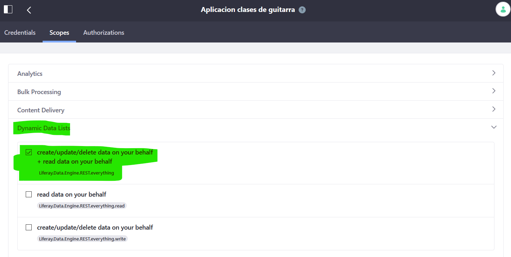
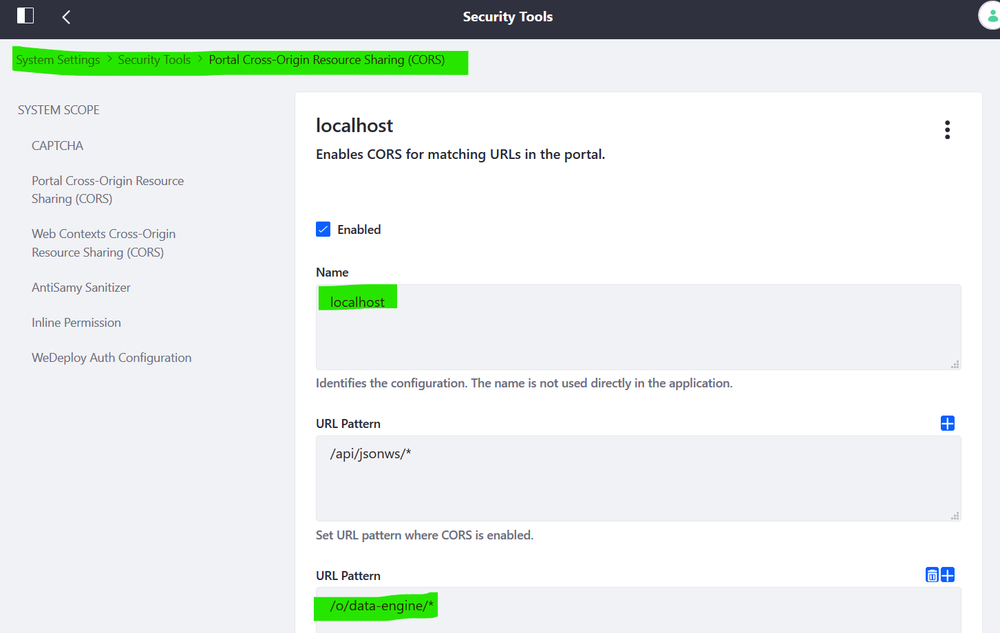

<h1 align="center">
  Liferay Data Engine Demo
</h1>

Este repositorio contiene un ejemplo sobre Data Engine mostrado en el Liferay Symposium Spain 2019, contiene una aplicación [Gatsby.js](https://www.gatsbyjs.org/) que hace uso de las APIs de [Liferay Data Engine](https://portal.liferay.dev/docs/7-2/frameworks/-/knowledge_base/f/data-engine).

Como prerequisitos necesitaremos un Liferay 7.2+ con una construcción de master reciente. Esta demo está probada con una versión de master del 15/10/2019. Es probable que en fechas posteriores haya cambios que no se reflejen en esta demo.
Además necesitaremos [instalar Gatsby en nuestro sistema.](https://www.gatsbyjs.org/docs/quick-start#install-the-gatsby-cli)

## 🚀 Quick start

1.  **Crear aplicación OAUTH2.**

    Puedes seguir el tutorial de Liferay Dev para [crear una aplicación OAUTH2.](https://portal.liferay.dev/docs/7-2/deploy/-/knowledge_base/d/oauth-2-0#creating-an-application) Una vez obtengas un client-id y un client-secret, sustituye sus valores en las variables que encontrarás en /src/components/tokenFunctions.js

1.  **Añade el scope de Data Engine y crea un CORS.**

    En la configuración de OAUTH2, ve a la pestaña "Scopes" y en el acordeón "Dynamic Data Lists", marca el check "Data Engine Everything" y salva:

    
    
    En Configuration -> System Settings -> Security Tools, pulsa en "Portal Cross-Origin Resource Sharing (CORS)" y pulsa "Add". Ponle un nombre, añade un URl Pattern "/o/data-engine/*" y salva:

    

    (Esto es necesario para que las peticiones de localhost:8000 de la app Gatsby puedan llegar correctamente a Liferay.)


1.  **Crear las entidades.**

    Utiliza las API's de Data Engine para crear un Data Definition, un Data Record Collection y un Data Record, utilizando tanto las APIs de Data Engine como un token de OAUTH2. Puedes mirar /src/components/tokenFunctions.js para ver cómo recuperar un token y /src/pages/index.js y /src/pages/create-lesson.js para ver cómo llamar a Data Engine.
    Puedes encontrar las definiciones json que yo he usado en el directorio "json-definitions"

1.  **Copia el id del Data Record Collection creado.**

    Y pégalo en la constante colleccion_todas_las_clases, se utilizará tanto para recuperar las clases creadas como para crear nuevas.

1.  **Ejecuta 'gatsby develop'**

    En el terminal apuntando al directorio raíz del proyecto, ejecuta lo siguiente:
    ```
    gatsby develop
    ```
    La demo debería estar corriendo en `http://localhost:8000`!


